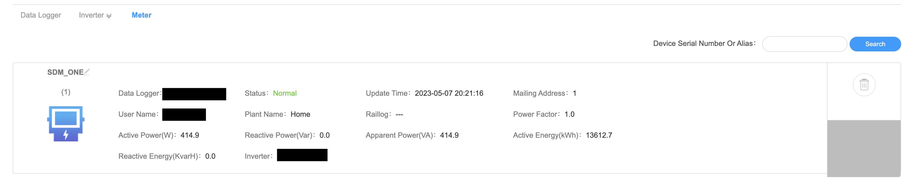

# ESP-Meter

This project is a little ESP32 which is used at home to monitor my

 - Water Consumption
 - Gas Consumption
 - Power Consumption

The "meter" values are published to MQTT including [Home Assistant Discovery messages](https://www.home-assistant.io/integrations/mqtt/#mqtt-discovery).
On top of that, I also emulate an Eastron SDM230 via Modbus to be able to limit energy export from my Growatt Inverter.

Disclaimer: this project does not claim to be a full product but is rather a place to document and share my findings in case anybody is interested.

# Plugins

The individual "meters" are structured in a lame `/plugins/`structure.

## Water Consumption

I have a regular water meter without any smartness or magnets attached. But it has a small wheel with reflective foil which is used to detect turns.

#### Used Hardware

 - CNY70: Photodiode and Emitter-LED in a housing
 - 100 Ohm resistor to limit current for the Emitter-LED
 - 2.2k Ohm resistor to let voltage drop (and be measurable by ESP)

#### Approach

 - Turn off LED
 - Measure voltage (a) using ESP ADC
 - Turn on LED
 - Measure voltage (b) using ESP ADC
 - (b) - (a) is the relevant value
 - If value moves from low threshold to high threshold -> increase counter

## Gas Consumption

I have a non smart gas meter. Luckily it as a small magnet in one of the ending digits.

#### Used Hardware

- Reed contact

#### Approach

- Debounce reed contact (50ms), on each falling edge -> increase counter

## Power Consumption

My Smart-Meter `eBZ DD3` already has an optical output interface which can be read out using a photo-diode.

#### Used Hardware

- Photodiode (not sure about the brand/make anymore)

#### Approach

- Read serial input
- Interpret OBIS messages

## Eastron SDM230 Emulation

The Growatt inverter can use the Modbus to communicate to SDM power meters. This plugin emulates an `SDM230`so the inverter can limit its power output and not feed too much into the grid.

#### Used Hardware

- DSD TECH SH-U12 RS485 to TTL (MAX13487)

#### Approach

- Take current power from `Power Consumption` plugin
- Store into according registers

#### Known issues

While the general data looks fine on Growatt Cloud (and export limiting works), the inverter seems to overshoot quite some times and bounces around the limit.

